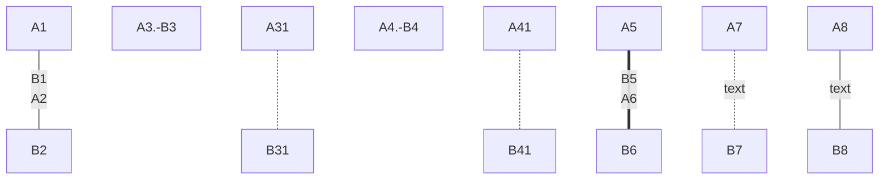

# markdown 图表

[toc]

****

## 一、表格

语法格式如下：
```
|  表头   | 表头  |
|  ----  | ----  |
| 单元格  | 单元格 |
| 单元格  | 单元格 |
```
使用 | 来分隔不同的单元格，使用 - 来分隔表头和其他行。


**表格的对齐方式：**

- `-:` 设置内容和标题栏居右对齐。
- `:-` 设置内容和标题栏居左对齐。
- `:-:` 设置内容和标题栏居中对齐。


显示效果：

| 表头   | 表头   |
| ------ | ------ |
| 单元格 | 单元格 |
| 单元格 | 单元格 |

***

## 二、组织结构图 mermaid

语法结构

```
	​```mermaid
	graph 方向
	节点以及节点连线（定义和连线步骤可以分开）
	（样式调整）
\```  
```
```


```

```mermaid
	graph 方向
	节点以及节点连线（定义和连线步骤可以分开）
（样式调整）
```


https://www.jianshu.com/p/789f02d745ec?open_source=weibo_search

http://blog.yahui.wang/2019/04/09/talkabout-markdown-mermaid/

https://blog.csdn.net/suoxd123/article/details/84992282

***


***

#### 节点类型

   节点本身的展现形式，是通过不同括号来代表各自不同的形状，默认为矩形。

- 默认节点： A
- 矩形节点： B[矩形]
- 圆角矩形节点： C(圆角矩形)
- 圆形节点： D((圆形))
- 非对称节点： E非对称]
- 菱形节点： F{菱形}


***

#### 显示方向

- TB/TD（ top bottom/top down）表示从上到下
- BT（bottom top）表示从下到上
- RL（right left）表示从右到左
- LR（left right）表示从左到右


***

节点连线

线条本身的形式有多种，通过常规的英文格式的格式来标识，具体如下：

箭头连接 `A1--B1`
开放连接 `A2---B2`
虚线箭头连接 `A3.-B3` 或者 `A3-.-B3`
虚线连接`A4.-B4` 或者 `A4-.-B4`
粗线箭头连接 `A5==B5`
粗线开放连接 `A6===B6`
标签虚线箭头连接 `A7-.text.-B7`
标签开放连接 `A8--text---B8`


***




***


***
```
​```mermaid
	graph TB
	A[Apple]--B{Boy}
	A---C(Cat)
	B.-D((Dog))
	C==喵==D
	style A fill:#2ff,fill-opacity:0.1,stroke:#faa,stroke-width:4px
	style D stroke:#000,stroke-width:8px;
```
```

***

​```mermaid
	graph TB
	A[Apple]--B{Boy}
	A---C(Cat)
	B.-D((Dog))
	C==喵==D
	style A fill:#2ff,fill-opacity:0.1,stroke:#faa,stroke-width:4px
	style D stroke:#000,stroke-width:8px;
```


***


```mermaid
graph TD
A[总经理] --|A1| B(XX副总)
B -- C[XX部]
B -- D[XX部]
B -- E[XX部]
C-- G[模块4]
C-- H[模块5]
C-- J[模块6]
D-- K[模块K]
E-- L[模块1]
E-- Z[模块2]
E-- X[模块3]
~~~


​```mermaid
graph TD
A[总经理] --|A1| B(XX副总)
B -- C[XX部]
B -- D[XX部]
B -- E[XX部]
C-- G[模块4]
C-- H[模块5]
C-- J[模块6]
D-- K[模块K]
E-- L[模块1]
E-- Z[模块2]
E-- X[模块3]
```

***


```
​```mermaid
graph LR
A[方形] --B(圆角)
    B -- C{条件a}
    C --|a=1| D[结果1]
    C --|a=2| E[结果2]
    F[横向流程图]
​```
```

***

```mermaid
graph LR
A[方形] --B(圆角)
    B -- C{条件a}
    C --|a=1| D[结果1]
    C --|a=2| E[结果2]
    F[横向流程图]
```

